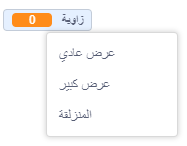

انقر بزر الماوس الأيمن على `متغير`{:class="block3variables"} الموجود على المنصة.

اختر**المنزلقة** في القائمة.

**نصيحة:** على الجهاز اللوحي، انقر مرتين على `متغير`{:class="block3variables"} على المنصة لتغير بين خيارات العرض.

انقر بزر الماوس الأيمن مرة أخرى على `متغير`{:class="block3variables"} المعروض على المنصة وحدد **تغيير مجال المنزلقة**.

لتعيين المجال ، حدد القيمة الدنيا والقيمة العظمى.

على سبيل المثال ،القيمة الدنيا`1` والقيمة العظمى `10` يعمل بشكل جيد إلى حد ما لمدى سرعة دوران الكائن.

يعتمد مجال المنزلقة المناسب للمتغير الخاص بك على الغرض الذي تستخدمه من أجله. ستحتاج أحيانًا إلى التجربة قليلاً حتى تحصل عليها بشكل صحيح ، لكن تذكر أنه يمكنك تغييرها في أي وقت.

اسحب المنزلقة إلى موضع جيد على المنصة.

**نصيحة:** إذا كنت تستخدم جهاز كمبيوتر بلوحة مفاتيح ، فيمكنك استخدام مفاتيح الأسهم لتغيير قيمة شريط التمرير بمقدار `-1`. أولاً ، انقر فوق المنزلقة لتحديده ، ثم استخدم اتجاه<kbd>اليسار</kbd> لتغيير القيمة بمقدار `1` ثم استخدم اتجاه<kbd>اليمين</kbd> لتغيير القيمة بمقدار `1`.

