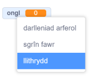
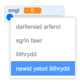
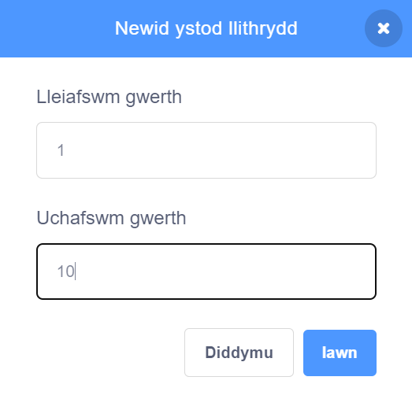

Right-click on your `variable`{:class="block3variables"} on the Stage.

Dewisa **llithrydd** yn y ddewislen.

**Tip:** On a tablet, double tap on the `variable`{:class="block3variables"} on the Stage to change between the display options.

De-glicia unwaith eto ar y `newidyn`{:class="block3variables"} sy'n ymddangos ar y Llwyfan a dewis **newid amrediad y llithrydd**.

I osod yr amrediad, dewisa isafswm ac uchafswm.

Er enghraifft, mae isafswm o `1` ac uchafswm o `10` yn gweithio'n eithaf da wrth droelli'r coflun.

Mae'r amrediad sydd orau ar gyfer dy newidyn yn dibynnu beth rwyt ti'n ei wneud ag ef. Weithiau bydd angen i ti arbrofi rhywfaint i gael yr amrediad yn gywir. Ond cofia, galli di ei newid ar unrhyw adeg.

Llusga'r llithrydd i'r safle gorau ar y Llwyfan.

**Awgrym:** Os wyt ti'n defnyddio cyfrifiadur gyda bysellfwrdd, galli di ddefnyddio'r saethau i newid gwerth y llithrydd fesul `1`. Yn gyntaf, clicia ar y llithrydd i'w ddewis, wedyn defnyddio'r saeth <kbd>Chwith</kbd> i newid y gwerth fesul `-1` a'r saeth <kbd>Dde</kbd> i newid y gwerth fesul `1`.
