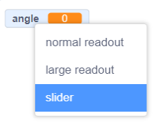
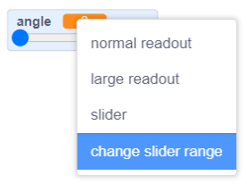
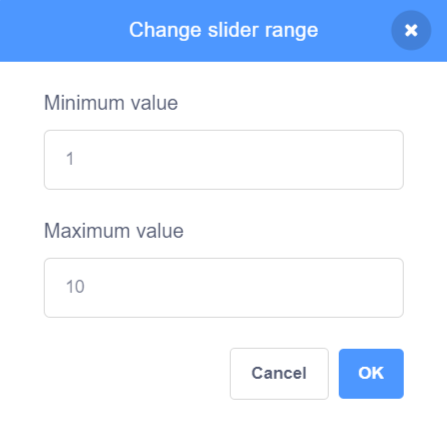

Right-click on your `variable`{:class="block3variables"} on the Stage.

Select **slider** in the menu. 

**Tip:** On a tablet, double tap on the `variable`{:class="block3variables"} on the Stage to change between the display options. 

Right-click again on the `variable`{:class="block3variables"} displayed on the Stage and select **change slider range**.

To set the range, specify a minimum and maximum value.

For example, a minimum of `1` and a maximum of `10` work fairly well for how quickly a sprite spins.

The value range that is right for your variable depends on what you are using it for. Sometimes you will need to experiment a little to get it right, but remember that you can change it at any time.

Drag the slider to a convenient position on the Stage.

**Tip:** If you are using a computer with a keyboard, then you can use the arrow keys to change the value of a slider by `1`. First, click on the slider to select it, then use the <kbd>Left</kbd> arrow key to change the value by `-1` and the <kbd>Right</kbd> arrow key to change the value by `1`.
