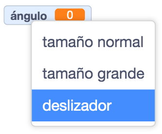
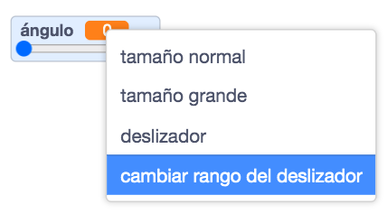
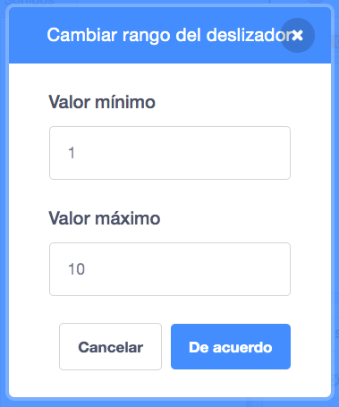

Right-click on your `variable`{:class="block3variables"} on the Stage.

Selecciona **deslizador** en el menú.

**Tip:** On a tablet, double tap on the `variable`{:class="block3variables"} on the Stage to change between the display options.

Vuelve a hacer clic derecho en la `variable`{:class="block3variables"} que se muestra en el Escenario y selecciona **cambiar rango del deslizador**.

Para fijar el rango, especifica un valor mínimo y un valor máximo.

Por ejemplo, un mínimo de `1` y un máximo de `10` funcionan bastante bien para determinar la velocidad con la que gira un objeto.

El rango de valores adecuado para tu variable depende de para qué la estés utilizando. A veces, necesitarás experimentar un poco para hacerlo bien, pero recuerda que puedes cambiarlo en cualquier momento.

Arrastra el deslizador a una posición conveniente en el Escenario.

**Sugerencia:** Si estás utilizando una computadora con un teclado, puedes usar las flechas para cambiar el valor en el deslizador en `1`. Primero, haz clic en el deslizador para seleccionarlo, luego usa la flecha <kbd>Izquierda</kbd> para cambiar el valor por `-1` y la flecha <kbd>Derecha</kbd> para cambiar el valor por `1`.
