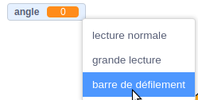
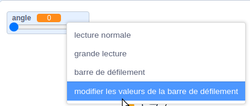
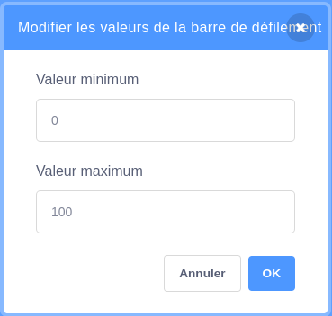

Fais un clic droit (ou sur une tablette, appuies et maintiens) sur ta `variable`{:class="block3variables"} sur la scène.

Sélectionne **barre de défilement** dans le menu.

**Astuce :** Tu peux double-cliquer (ou sur une tablette, taper) sur la `variable`{:class="block3variables"} affichée sur la Scène et sélectionner **barre de défilement**.

Clique à nouveau avec le bouton droit sur la `variable`{:class="block3variables"} affichée sur la scène et sélectionne **modifier les valeurs de la barre de défilement**.

Pour définir la plage, spécifie une valeur minimale et maximale.

Par exemple, un minimum de `1` et un maximum de `10` fonctionnent assez bien pour la vitesse à laquelle un sprite tourne.

La plage de valeurs qui convient à ta variable dépend de l'utilisation que tu en fais. Parfois, tu devras expérimenter un peu pour bien faire les choses, mais n'oublie pas que tu peux le modifier à tout moment.

Fais glisser la barre de défilement vers une bonne position sur la scène.

**Astuce :** Si tu utilises un ordinateur avec un clavier, tu peux utiliser les touches fléchées pour modifier la valeur d'une barre de défilement de `1`. Tout d'abord, clique sur la barre de défilement pour la sélectionner, puis utilise la touche flèche <kbd>Gauche</kbd> pour modifier la valeur de `-1` et la touche flèche <kbd>Droite</kbd> pour modifier la valeur de `1`.

