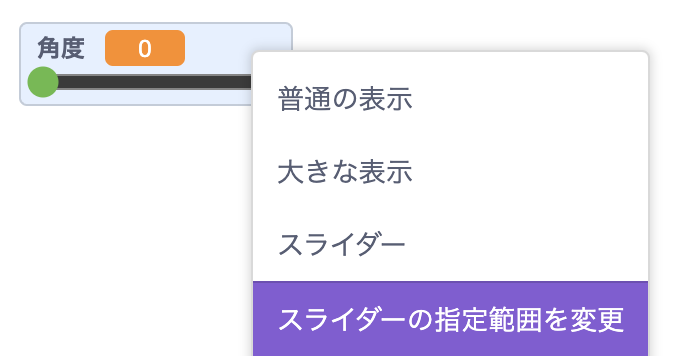

ステージ上の `変数`{:class="block3variables"} を右クリックします。

メニューで **スライダー** を選択します。

**助言:** タブレットでは、ステージ上の `変数`{:class="block3variables"} をダブルタップして、表示オプションを切り替えます。

ステージ上に表示されている `変数`{:class="block3variables"} を再度右クリックし、 **スライダー範囲の変更**を選択します。

範囲を設定するには、最小値と最大値を指定します。

たとえば、スプライトの回転速度については、最小値を `1` 、最大値を `10` にするとうまく機能します。

変数の範囲に適切な値は、その変数を何に使用するかによって異なります。 場合によっては、正しく設定するために少し試行錯誤する必要がありますが、いつでも変更できることを覚えておいてください。

スライダーをステージ上の使いやすい位置にドラッグします。

**助言:** キーボード付きのコンピューターを使用している場合は、矢印キーを使用してスライダーの値を `1`ずつ変更できます。 まず、スライダーをクリックして選択し、次に <kbd>左</kbd> 矢印キーを使用して値を `-1` ずつ変更し、 <kbd>右</kbd> 矢印キーを使用して値を `1`ずつ変更します。
