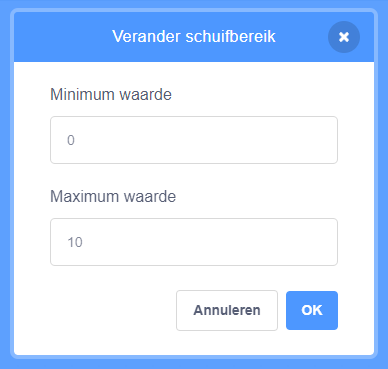

Klik met de rechtermuisknop op jouw `variabele`{:class="block3variables"} in het speelveld.

Selecteer **schuifregelaar** in het menu.

**Tip:** Je kunt dubbelklikken (of op een tablet tikken) op de `variabele`{:class="block3variables"} die in het speelveld wordt weergegeven en **schuifregelaar** selecteren.

Klik nogmaals met de rechtermuisknop op de `variabele`{:class="block3variables"} in het speelveld en selecteer **verander schuifbereik**.

Geef een minimum- en maximumwaarde op om het bereik in te stellen.

Een minimum van `1` en een maximum van `10` werkt bijvoorbeeld redelijk goed voor een snelheid waarmee een sprite draait.

Het waardebereik dat geschikt is voor jouw variabele hangt af van waarvoor je het gebruikt. Soms moet je een beetje experimenteren om het goed te krijgen, maar onthoud dat je het op elk moment kunt wijzigen.

Sleep de schuifregelaar naar een geschikte positie in het speelveld.

**Tip:** Als je een computer met een toetsenbord gebruikt, kun je de pijltoetsen gebruiken om de waarde van een schuifregelaar met `1` te wijzigen. Klik eerst op de schuifregelaar om deze te selecteren en gebruik vervolgens de <kbd>Linker</kbd> pijltoets om de waarde te wijzigen met `-1` en de <kbd>Rechter</kbd> pijltoets om de waarde te wijzigen met `1`.
