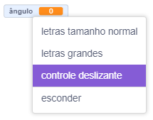
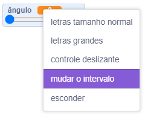

Clique com o botão direito na sua `variável`{:class="block3variables"} no Palco.

Selecione **controle deslizante** no menu.

**Dica:** Em um tablet, no palco, toque duas vezes na `variável`{:class="block3variables"} para alternar entre as opções de exibição.

Clique com o botão direito novamente na `variável`{:class="block3variables"} exibida no Palco e selecione **mudar o intervalo**.

Para definir o intervalo, especifique um valor mínimo e máximo.

Por exemplo, um mínimo de `1` e um máximo de `10` funcionam bem para determinar a velocidade com que um ator gira.

O intervalo de valores correto para sua variável depende da finalidade para a qual você a está usando. Às vezes você precisará experimentar um pouco para acertar, mas lembre-se de que você pode alterá-lo a qualquer momento.

Arraste o controle deslizante para posição conveniente no Palco.

**Dica:** Se você estiver usando um computador com teclado, poderá usar as teclas de seta para alterar o valor de um controle deslizante em `1`. Primeiro, clique no controle deslizante para selecioná-lo e, em seguida, use a tecla de seta <kbd>Esquerda</kbd> para alterar o valor em `-1` e a tecla de seta <kbd>Direita</kbd> para alterar o valor em `1`.
