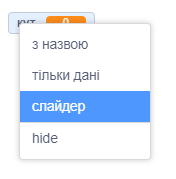
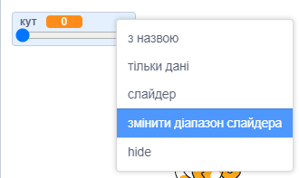
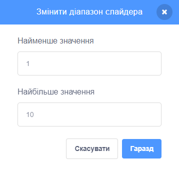

Клацни правою кнопкою миші по своїй `змінній`{:class="block3variables"} на Сцені.

Вибери елемент **повзунок** в меню.

**Порада:** на планшеті для переключення між варіантами відображення двічі натисни на `змінну`{:class="block3variables"}, яка знаходиться на Сцені.

Ще раз клацни правою кнопкою миші на `змінну`{:class="block3variables"}, яка знаходиться на Сцені, та вибери **змінити діапазон повзунка**.

Для встановлення діапазону необхідно вказати мінімальне та максимальне значення.

Наприклад, мінімум `1` і максимум `10` досить добре підходять для швидкості обертання спрайту.

Діапазон значень, які підходять для твоєї змінної, залежить від того, для чого ти її використовуєш. Іноді потрібно буде трохи поекспериментувати, щоб отримати потрібний результат, але пам'ятай, що ти можеш змінити все це в будь-який момент.

Перетягни повзунок у зручне положення на Сцені.

**Порада:** якщо ти використовуєш комп'ютер з клавіатурою, то можеш за допомогою клавіш зі стрілками змінити значення повзунка на `1`. Спочатку клацни на повзунок, щоб вибрати його, а потім скористайся клавішею зі стрілкою <kbd>Ліворуч</kbd>, щоб змінити значення на `-1`, та клавішею зі стрілкою <kbd>Праворуч</kbd>, щоб змінити значення на `1`.
